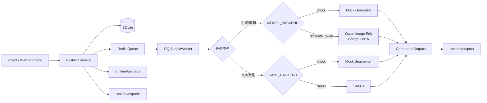
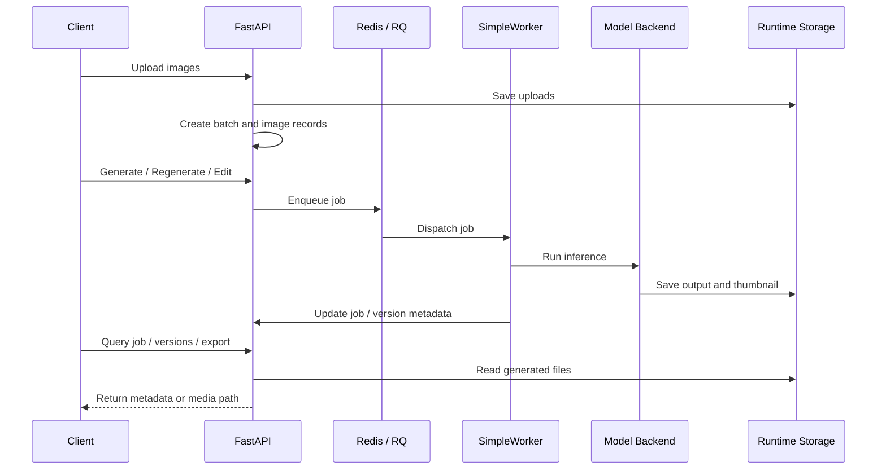

# Gongbi Batch Repaint

<div align="center">

<h3>单机 GPU 工笔画批处理</h3>

<p>
  支持多图上传、批量初始生成、重生成、自然语言语义编辑、历史版本管理与 ZIP 导出。
  支持通过 SAM 3 文本提示词分割目标，并输出全尺寸 Mask 与透明背景子图。
</p>

<p>
  
  
  
  
  
</p>

</div>


## 项目概览

**Gongbi Batch Repaint** 是一个面向单机 GPU 推理场景的工笔画批处理后端。项目以 FastAPI 提供批处理接口，以 Redis + RQ 承接串行 GPU 推理任务，并通过 SQLite 与本地文件系统保存批次、图片、版本、缩略图和导出文件。

当前版本完成了后端能力与接口替换：

* 多图上传与批次管理
* 批量初始工笔画生成
* 单图重生成
* 基于自然语言的语义编辑
* SAM 3 开放词汇文本分割
* 历史版本查询
* ZIP 结果导出
* Mock 推理环境下的本地开发与接口验证
* DiffSynth-Studio + Qwen-Image-Edit-2511 + 工笔 LoRA 的生产推理部署

## 目录

* [项目概览](#项目概览)
* [架构](#架构)
* [目录与运行时存储](#目录与运行时存储)
* [快速启动](#快速启动)
* [公共接口](#公共接口)
* [语义编辑请求示例](#语义编辑请求示例)
* [正式离线部署](#正式离线部署)
* [验证](#验证)
* [功能边界](#功能边界)
* [前端对接说明](#前端对接说明)

## 架构

### 技术栈

| 模块   | 技术选型                                              | 说明                                                                        |
| ---- | ------------------------------------------------- | ------------------------------------------------------------------------- |
| API  | FastAPI                                           | 提供图片、批次、任务、版本与导出接口                                                        |
| 数据库  | SQLite                                            | 默认数据库路径为 `runtime/db.sqlite`                                              |
| 队列   | Redis + RQ                                        | 通过单个 `SimpleWorker` 串行使用 GPU                                              |
| 开发推理 | `MODEL_BACKEND=mock`                              | 本地开发默认模式，不需要 GPU 和模型                                                      |
| 生产推理 | DiffSynth-Studio + Qwen-Image-Edit-2511 + 工笔 LoRA | 面向正式 GPU 推理环境                                                             |
| 图像分割 | SAM 3                                             | 根据简短文本提示词分割所有匹配实例，保存 Mask、透明子图和 bbox                                 |
| 存储   | 本地文件系统                                            | 使用 `runtime/uploads`、`runtime/outputs`、`runtime/thumbs`、`runtime/exports` |

### 后端流程



### 任务执行模型




## 目录与运行时存储

默认运行时文件位于 `runtime/` 下：

| 路径                  | 用途               |
| ------------------- | ---------------- |
| `runtime/db.sqlite` | SQLite 数据库       |
| `runtime/uploads`   | 用户上传的原始图片        |
| `runtime/outputs`   | 生成结果，以及 SAM 3 Mask 和透明子图 |
| `runtime/thumbs`    | 缩略图              |
| `runtime/exports`   | ZIP 导出文件         |
| `runtime/models`    | 离线部署时使用的模型文件目录   |


## 快速启动

### Docker Compose 启动

```bash
cp .env.example .env
docker compose -f infra/docker/docker-compose.yml up --build
```

### 本地开发启动

本地开发默认使用 Mock 后端，不需要 GPU 和模型。

```bash
python3 -m venv .venv
source .venv/bin/activate
pip install -r services/api/requirements.txt -r services/worker/requirements.txt
make api
make worker
```

> [!TIP]
> Mock 模式适合验证接口、任务流、数据库写入、版本记录和 ZIP 导出流程；正式图像质量验证需要切换到 `diffsynth_qwen` 后端。

## 公共接口

| Method | Path                                | 说明               |
| ------ | ----------------------------------- | ---------------- |
| `POST` | `/api/images/upload`                | 上传图片并创建批次 / 图片记录 |
| `GET`  | `/api/batches/{batch_id}`           | 查询批次详情           |
| `POST` | `/api/batches/{batch_id}/generate`  | 对批次执行初始生成        |
| `POST` | `/api/images/{image_id}/regenerate` | 对单张图片执行重生成       |
| `POST` | `/api/images/{image_id}/edit`       | 对单张图片执行自然语言语义编辑  |
| `GET`  | `/api/jobs/{job_id}`                | 查询任务状态           |
| `GET`  | `/api/images/{image_id}/versions`   | 查询图片历史版本         |
| `POST` | `/api/batches/{batch_id}/export`    | 导出批次结果 ZIP       |
| `POST` | `/api/images/{image_id}/segment`    | 按文本提示词提交 SAM 3 分割任务 |
| `GET`  | `/api/images/{image_id}/segments`   | 查询最新或指定提示词的分割结果 |
| `GET`  | `/api/segments/{segment_id}/image`  | 获取透明背景子图 |
| `GET`  | `/api/segments/{segment_id}/mask`   | 获取全尺寸灰度 Mask |
| `GET`  | `/media/{path}`                     | 访问上传、输出、缩略图或导出文件 |


## 语义编辑请求示例

```json
{
  "version_id": "历史版本 ID",
  "user_prompt": "把人物衣服改成红色",
  "seed": 123
}
```

字段说明：

| 字段            | 类型     | 说明            |
| ------------- | ------ | ------------- |
| `version_id`  | string | 要基于哪个历史版本继续编辑 |
| `user_prompt` | string | 用户自然语言编辑指令    |
| `seed`        | number | 随机种子，用于结果复现   |

## 通过 ModelScope 载入 SAM 3

项目已接入 ModelScope SDK。首次 SAM 3 分割时，如果 `SAM3_CHECKPOINT_PATH` 指向的本地权重不存在，并且
`SAM3_MODEL_SOURCE=modelscope`，Worker 会通过 `snapshot_download()` 下载模型，再使用仓库内置的 SAM 3
推理代码加载 `sam3.pt`。

安装依赖并预先下载项目所需权重：

```bash
pip install modelscope
python scripts/download_sam3_modelscope.py
```

默认仅下载 `sam3.pt`。如需下载 ModelScope 上的完整模型仓库：

```bash
python scripts/download_sam3_modelscope.py --full
```

运行真实分割时使用：

```text
SAM3_BACKEND=sam3
SAM3_MODEL_SOURCE=modelscope
SAM3_CHECKPOINT_PATH=./runtime/models/sam3/sam3.pt
SAM3_MODELSCOPE_MODEL_ID=facebook/sam3
SAM3_MODELSCOPE_REVISION=master
SAM3_MODELSCOPE_LOCAL_DIR=./runtime/models/sam3
SAM3_DEVICE=cuda
SAM3_AMP_DTYPE=bfloat16
```

已存在的 `SAM3_CHECKPOINT_PATH` 始终优先，因此联网环境可自动下载，离线环境也可直接挂载预下载权重。

## 正式离线部署

### 1. 在联网机器准备模型

在可联网机器安装 `hf` CLI 和 ModelScope SDK 后执行：

```bash
pip install modelscope
bash scripts/prepare_offline_models.sh runtime/models
```

Qwen 和 LoRA 仍通过 `hf` CLI 下载；SAM 3 改由 ModelScope SDK 下载。可通过 `SAM3_REVISION` 固定
ModelScope revision，默认值为 `master`。

然后将 `runtime/models` 随部署包复制到正式服务器。

### 2. 配置生产推理环境变量

在正式服务器设置：

```text
MODEL_BACKEND=diffsynth_qwen
QWEN_EDIT_MODEL_PATH=/models/qwen_image_edit_2511
QWEN_IMAGE_COMPONENTS_PATH=/models/qwen_image
QWEN_EDIT_PROCESSOR_PATH=/models/qwen_image_edit/processor
GONGBI_LORA_PATH=/models/lora/qwen_image_edit_2511_gongbi_lora_v1.safetensors
GONGBI_LORA_SCALE=1.0
SAM3_BACKEND=sam3
SAM3_PRELOAD=false
SAM3_MODEL_SOURCE=local
SAM3_CHECKPOINT_PATH=/models/sam3/sam3.pt
SAM3_DEVICE=cuda
```

`MODEL_BACKEND` 与 `SAM3_BACKEND` 相互独立。默认不在 Worker 启动时预加载 SAM 3，因此 SAM 权重缺失或配置错误
不会阻塞 Qwen 生成任务；首次分割任务会按需加载模型。显存足够且希望提前发现配置错误时，可设置
`SAM3_PRELOAD=true`。

GPU Worker 镜像使用 Python 3.12、PyTorch 2.7 和 CUDA 12.6 wheels，以满足仓库内置 SAM 3 源码的运行要求。
生成与分割共用单 GPU Worker，切换任务类型时会释放另一套模型缓存，避免 Qwen 与 SAM 3 长期同时占用显存。

### 3. 使用 GPU Compose 启动

```bash
docker compose \
  -f infra/docker/docker-compose.yml \
  -f infra/docker/docker-compose.gpu.yml \
  up -d
```

### 4. 准备完整离线部署包

联网机器可进一步准备包含 Docker 镜像和项目文件的离线部署包：

```bash
bash scripts/prepare_offline_bundle.sh
```

离线服务器解压项目包后执行：

```bash
docker load -i docker-images.tar
```

然后继续使用 GPU Compose 启动：

```bash
docker compose \
  -f infra/docker/docker-compose.yml \
  -f infra/docker/docker-compose.gpu.yml \
  up -d
```

## 验证

### 单元测试与 Mock E2E

```bash
pytest -q
./scripts/e2e_mock.sh
```

GPU 环境可使用真实图片验证 SAM 3：

```bash
scripts/verify_sam3.sh /path/to/test-image.png
```

### GPU 环境额外验证项

GPU 环境需额外验证以下内容：

* LoRA 整图生成效果
* 自然语言语义编辑效果
* SAM 3 文本分割、Mask 尺寸与透明子图效果
* 多图任务串行排队效果
* Worker 启动后模型与 LoRA 是否正确常驻 GPU
* 批次导出 ZIP 是否包含预期输出文件
* 历史版本链路是否完整

## 功能边界

当前版本支持：

* 多图上传
* 批量初始生成
* 单图重生成
* 自然语言语义编辑
* SAM 3 文本分割
* 历史版本记录
* ZIP 导出
* Mock 开发推理
* DiffSynth-Studio + Qwen-Image-Edit-2511 + 工笔 LoRA 生产推理


## 前端对接说明

`apps/web` 已接入批次、版本、语义编辑和 SAM 3 分割接口：

| API 族       | 主要用途                |
| ----------- | ------------------- |
| Batch API   | 批次创建、批次查询、批量生成、批次导出 |
| Image API   | 图片上传、单图重生成、单图语义编辑   |
| Version API | 图片历史版本查询            |
| Job API     | 异步任务状态查询            |
| Media API   | 上传图、输出图、缩略图、导出文件访问  |
| Segment API | 文本分割、Mask 与透明子图查询 |

建议前端围绕以下核心页面重构：

* 批次上传页
* 批次生成进度页
* 图片版本查看页
* 单图重生成 / 语义编辑 / SAM 3 分割页
* 批次 ZIP 导出页


## 开发状态

| 模块               | 状态            |
| ---------------- | ------------- |
| 后端 API           | 已完成当前版本接口替换   |
| Mock 推理          | 已支持           |
| RQ Worker 串行推理   | 已支持           |
| SQLite 元数据管理     | 已支持           |
| 本地运行时存储          | 已支持           |
| ZIP 导出           | 已支持           |
| GPU 生产推理         | 需在正式 GPU 环境验证 |
| SAM 3 GPU 推理       | 调用链已接通，需使用正式权重做质量与显存验证 |
| `apps/web` 新接口适配 | 已支持主流程与分割结果展示 |
